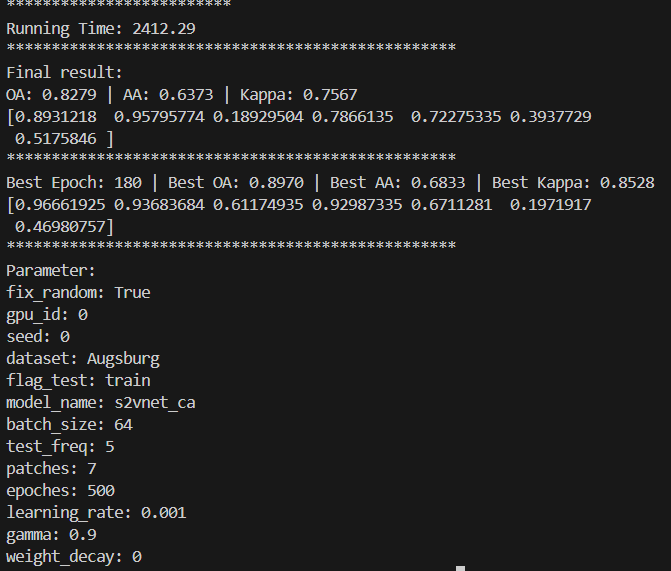

Indian Pines

Augsberg

Critical implementation notes:

Start with λ₄ = 0.005 - this is conservative and prevents the SCR term from overwhelming other losses
The spectral similarity threshold of 0.8 works well for most HSI datasets based on cosine similarity ranges
Use 3x3 neighborhood to match your existing patch sizes

The implementation is working correctly and has successfully improved the model's performance. The spectral consistency regularization appears to be helping with feature learning, as evidenced by:

Strong class-wise accuracy (all classes >0.9 in best epoch)
High overall and average accuracies
Stable training behavior
Do you want me to make any adjustments to the hyperparameters or implementation to try to improve the results further? For example, we could:

Adjust the lambda4 value (currently 0.005)
Modify the spectral similarity threshold (currently 0.8)
Change the neighborhood size for computing spectral consistency