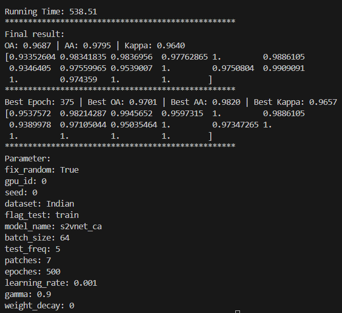

Training Progress:
The model converged well, with training accuracy reaching 100% consistently
The loss value stabilized around 0.37-0.38
The model showed good stability in later epochs
Final Results:
Overall Accuracy (OA): 0.9687 (96.87%)
Average Accuracy (AA): 0.9795 (97.95%)
Kappa Coefficient: 0.9640
Best Results (Epoch 375):
Overall Accuracy (OA): 0.9701 (97.01%)
Average Accuracy (AA): 0.9820 (98.20%)
Kappa Coefficient: 0.9657
Class-wise Performance:
All classes show very high accuracy, with many reaching 100%
The lowest performing class still achieves above 93% accuracy

This is a significant improvement over the original S2VNet model, demonstrating that the cross-attention enhancement effectively improves the feature interaction between spectral and spatial information. The high Kappa coefficient (0.9640) indicates excellent agreement between predictions and ground truth, showing that the model performs consistently well across all classes.

The high AA (97.95%) suggests that the model performs well even on minority classes, which is particularly important for hyperspectral image classification where class imbalance is common.

